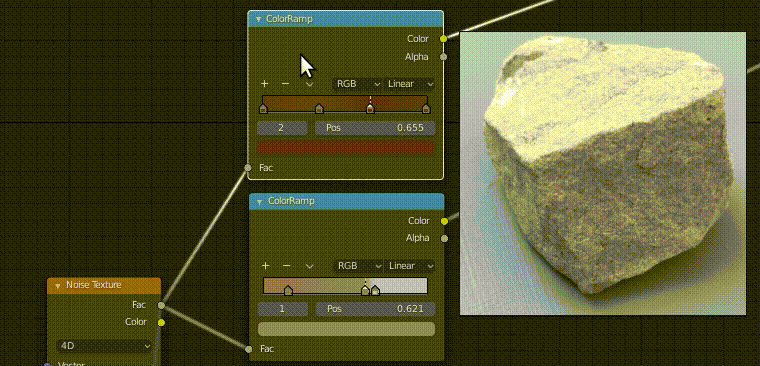

# Gradient Sampler

The Gradient Sampler Blender add-on let's users create color ramps just by
stroking over a reference image.

Blender minimal tested version: 2.83

A better compressed version can be seen [here](https://raw.githubusercontent.com/FrankFirsching/gradient_sampler/master/docs/example.webm).

## Usage

The add-on creates a new context menu entry, when a color ramp node is selected
in the shader editor. When activating it, the mouse turns into an eyedropper 
and you should stroke over an area, that shows the intended gradient from a 
reference image (e.g. in the image viewer of blender)

## Advanced usage

The add-on also supports sampling gradients from other applications (e.g. 
[PureRef](https://www.pureref.com/)). Since blender doesn't capture the mouse
completely in case no button is pressed, the add-on supports a two button press
workflow. You press the right mouse button within blender, then draw over to 
the external application. Afterwards stroke over the reference gradient having
both the right and left mouse button pressed. The add-on takes care to take the
shorter sampled gradient.

## Limitations

Blender only supports up to 32 entries within a gradient. In case the 
referenced gradient was longer, the add-on is resampling the gradient down
to this maximum number of entries. This can lead to inaccuracies.

## 3rd party software

The add-on uses the
[MSS screenshot library](https://github.com/BoboTiG/python-mss) of
Mickaël Schoentgen under a MIT license.